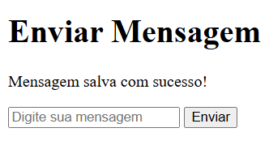

# README – Projeto Cliente-Servidor PHP na EC2 (Ubuntu)

## 1. Diferenças do Ubuntu para Amazon Linux

- Alguns comandos de instalação de pacotes diferem do Amazon Linux (Ubuntu usa `apt`, Amazon Linux usa `yum`).
- O Apache, PHP e MariaDB são instalados e configurados de forma diferente no Ubuntu.
- Criei um par de chaves SSH seguindo o mesmo passo a passo do Amazon Linux.

## 2. Conexão na instância EC2

```bash
ssh -i <sua_chave.pem> ubuntu@<DNS-PUBLICO-DA-EC2>
```

## 3. Instalação de dependências

```bash
sudo apt update
sudo apt install git -y
```

### PHP

```bash
sudo apt install php8.3-cli -y
```

### MariaDB

### Entrar no prompt do MariaDB:

```bash
sudo apt install mariadb-server mariadb-client -y
sudo systemctl start mariadb
sudo systemctl enable mariadb
sudo mysql_secure_installation
```

Durante a configuração do MariaDB, selecionei “yes” para todas as opções recomendadas.

### Apache

```bash
sudo apt update
sudo apt install apache2 php libapache2-mod-php -y
```

## 4. Clonando repositorio

```bash
git clone <meu_repositorio>
cd desafioClienteServidor
cd servidor
```

## 5. Configuração banco de dados

```bash
sudo mysql -u root -p
```

### Criar banco de dados

```sql
CREATE DATABASE cliente_servidor;
USE cliente_servidor;

CREATE TABLE mensagens (
    id INT AUTO_INCREMENT PRIMARY KEY,
    conteudo VARCHAR(255) NOT NULL,
    data_envio TIMESTAMP DEFAULT CURRENT_TIMESTAMP
);
EXIT;
```

## 6. Configuração do Apache

### Remover página padrão do Apache

```bash
cd /var/www/html
sudo rm index.html
```

##subir arquivos do projeto

```bash
sudo cp -r /home/ubuntu/desafioClienteServidor/servidor/* /var/www/html/
sudo chown -R www-data:www-data /var/www/html
sudo chmod -R 755 /var/www/html
```

### Reiniciar Apache

```bash
sudo systemctl restart apache2
```

## 7. Teste da aplicação

```bash
http://<DNS-PUBLICO-DA-EC2>
```

- A página inicial deve mostrar o formulário para envio de mensagens.
- Mensagens enviadas são salvas na tabela mensagens do banco cliente_servidor.


